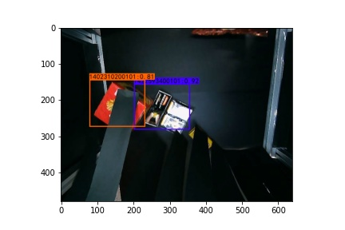

# yolov3-keras

I reference "[YOLOv3: An Incremental Improvement](https://arxiv.org/abs/1804.02767)" implement the object detection network.  


## Requriments
I use tensorflow2 implenment.
```
pip install -r requirments.txt
```

## Train
Step 1: Modify `config.py`  
```
    EPOCHS : The number of iteration. 
    BATCH_SIZE: You can modify size, according to your GPU.

    CLASSES: You want to train classes.
    
    DATASET : Dataset path
    VOC_TEXT_FILE: Dataset train, val, test images information.
    VOC_TRAIN_FILE: Produce train text file.

    MODEL_FOLDER : Stroage weigth folder
    FILE_NAME : Storage weigth weight
```
Open the common line or IDLE.  
Step 2: `python voc_annotation.py`
You can obtain three text files(train.txt, val.txt and test.txt)  
  
Step 3: `python train_300.py`  

## Test

If you want to use my weight file, you can go to download in the link.  
https://drive.google.com/file/d/1d6pQPtQi3t6YduDcCPW67Qi-hwxwVPfx/view?usp=sharing  

You can look `predict_image.ipynb`.  

### Execute results


## Evalutate model
Step 1: You need use `pip install predict_text.py` produce predicted results' text file.  
Step 2: `pip install evaluate.py`  

## Execute Video

`python video.py`  
You can look to detected result of video.

## Reference
[yolo3-keras](https://github.com/bubbliiiing/yolo3-keras)  
